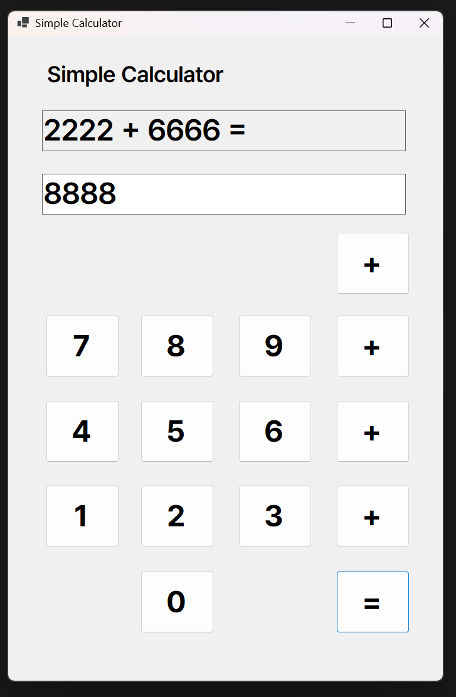
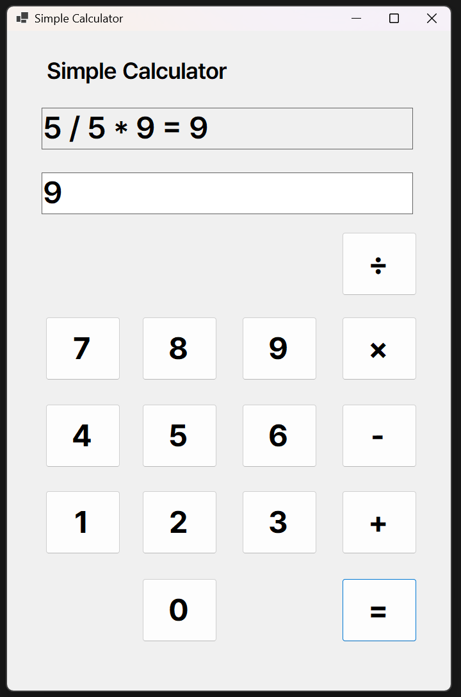
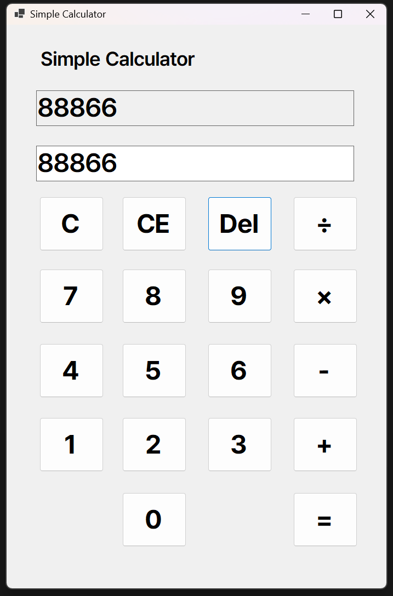
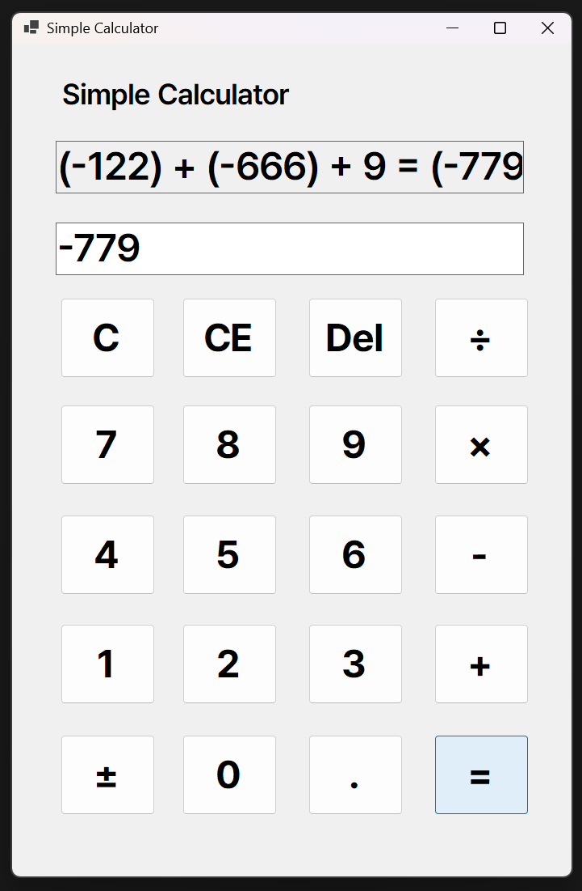

# 4주차 과제: 심플 사칙연산기

## 개요
- C# 프로그래밍 학습
- 1줄 소개: 간단한 사칙연산을 수행하는 프로그램
- 사용한 플랫폼:
    - C#, .NET Windows Forms, Visual Studio, Github
- 사용한 컨트롤:
    - Label, TextBox, Button
- 사용한 기술과 구현한 기능:
    - Visual Studio를 이용한 UI 디자인
    - ToString, Parse 등을 이용한 형변환
    - 동일한 메소드를 사용해 코드 간소화
    - 연산자를 두 번 눌러 계산을 체인하는 기능
    - ± 버튼을 통한 피연산자의 부호 변환

## 실행 화면 (과제1)
- 과제1 코드의 실행 스크린샷

- 과제 내용
    - TextBox(입력표시, 결과표시), Button(계산) 등을 적절히 배치합니다.
    - 숫자 Button 클릭 시 TextBox에 표시합니다. 2가지 방법으로 표시
    - 2개의 피연산자의 입력값을 Int로 바꾸어 더하기 계산을 수행하고 그 결과를 저장합니다.
    - 계산 결과 값을 문자열로 변환하여 표시합니다.

- 구현 내용과 기능 설명
    - TextBox와 Button을 배치해 계산기의 형태를 잡았다.
    - 기초적인 피연산자, 연산자 등의 변수를 만들어 로직의 기본 형태를 구성한다.
    - 숫자 버튼 전체에 적용할 btnNum_Click 이벤트를 만들어 적용한다.
    - + 버튼 뿐만이 아니라 ApplyOperation 함수를 만들어 모든 연산 버튼에 적용할 수 있도록 한다.
    - = 버튼을 누를 때 보류된 연산자를 확인하고 알맞게 동작시킨다.

## 실행 화면 (과제2)
- 과제2 코드의 실행 스크린샷

- 과제 내용
    - 뺄셈(-), 곱셈(\*), 나눗셈(\*) 버튼 추가
    - 이벤트 연결
    - 각 버튼 클릭 시 연산자만 변경하여 동일 로직 적용

- 구현 내용과 기능 설명
    - 앞서 구현한 ApplyOperation 함수를 이용해 모든 연산 버튼에 각각 적용한다.
    - 0으로 나눌 때를 대비한 우회를 추가한다.

## 실행 화면 (과제3)
- 과제3 코드의 실행 스크린샷

- 과제 내용
    - C 버튼
        - 현재의 모든 내용을 삭제하고 처음 (초기화된) 상태로 되돌아감
    - CE 버튼
        - 마지막 입력한 피연산자(Operand) 값을 삭제함
    - Del 버튼
        - 마지막 입력된 글자 하나 (숫자 하나) 값을 삭제함

- 구현 내용과 기능 설명
    - C, CE, Del 버튼을 각각 추가하고 그에 맞는 기능을 추가함.
    - 0으로 나눌 때의 오류 출력을 추가함.

## 실행 화면 (과제4)
- 과제4 코드의 실행 스크린샷

- 과제 내용
    - 쉽고 편하게 사용할 수 있도록 고민하여 기능 추가 또는 개선

- 구현 내용과 기능 설명
    - ± 버튼으로 피연산자의 부호를 바꾸는 기능을 추가함.
    - . 버튼으로 소수점을 입력하는 기능을 추가함.
    - (, ) 버튼을 추가하고, 사칙연산의 수학적 규칙에 따라 곱셈과 덧셈의 우선 순위를 조작하는 기능을 추가함.

## 배운 내용
- 이벤트를 하나의 요소에 국한시키지 않고 다양한 버튼에 동시에 적용할 수 있는 법을 배움.
- 각종 예외 처리와 간소화를 익힘.